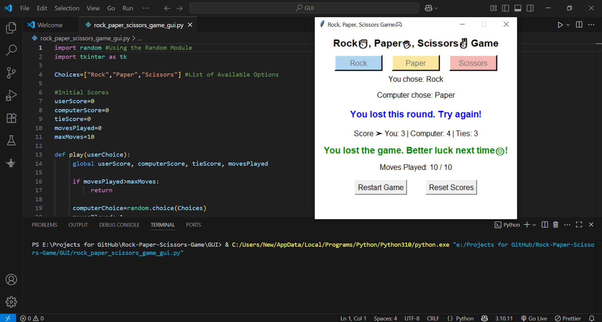
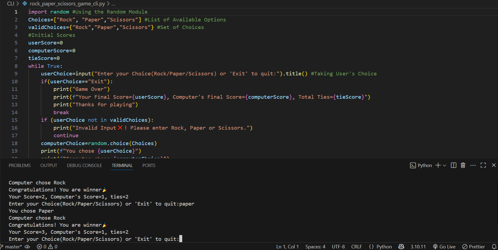

# Rock, Paper, Scissors Game 🎮

This is a simple Rock, Paper, Scissors game built using Python.  
It includes **two versions**:
- 🎨 GUI version using `Tkinter`
- 💻 CLI (Command Line Interface) version using plain Python

---

## 📁 Project Structure
```bash
Rock-Paper-Scissors-Game/
├── GUI/
│ └── rock_paper_scissors_game_gui.py
├── CLI/
│ └── rock_paper_scissors_game_cli.py
├── Screenshots/
│ ├── Screenshot_GUI.png
│ └── Screenshot_CLI.png
└── README.md
```
---

## 🖥️ GUI Version

- Built using **Tkinter**
- Colorful buttons for Rock, Paper, Scissors
- Score tracking
- Limited to 10 rounds
- Displays result after each move
- Shows final game result (Win/Lose/Draw)
- Restart or reset the game anytime

---

## 💻 CLI Version

- Runs in the command line
- User enters choices via keyboard
- Displays computer’s choice and round result
- Keeps track of score and ties
- Option to exit the game anytime

---

## 🚀 How to Run

### ▶️ GUI Version
```bash
python GUI/rock_paper_scissors_game_gui.py 
```
### ▶️ CLI Version
```bash
python CLI/rock_paper_scissors_game_cli.py
```

---

## 📦 Requirements

- Python 3.x  
- No external libraries required

---

## 📸 Screenshots

🎨 GUI Version:

💻 CLI Version:


---

## Author:
**Amina Habiba**
[LinkedIn](https://www.linkedin.com/in/aminahabiba) | [GitHub](https://github.com/AminaHabiba)